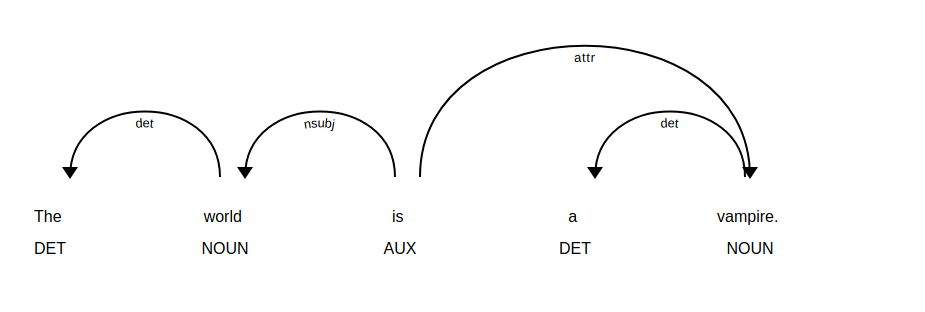

# Command Line Parser
- Often at work or while working on other projects I need to parse random sentences to get a feel for what types of linguistic phenomenon are going on 
- Despite being a linguist I often find myself second-guessing my judgements
- This commandline script offers two functions that help to alleviate this problem.

```
python parse.py -h
usage: parse.py [-h] [-c] [-d]

optional arguments:
  -h, --help     show this help message and exit
  -c, --cli      Command line string parser; 'quit' to exit; 'display' for
                 dependency graph
  -d, --display  Display dependency graph; 'C-c C-c' to exit
```

```
> python parse.py --cli
The world is a vampire
Token:The        Lemma:the        POS:DET    Tag:DT     Dep:det    Shape:Xxx   
Token:world      Lemma:world      POS:NOUN   Tag:NN     Dep:nsubj  Shape:xxxx  
Token:is         Lemma:be         POS:AUX    Tag:VBZ    Dep:ROOT   Shape:xx    
Token:a          Lemma:a          POS:DET    Tag:DT     Dep:det    Shape:x     
Token:vampire    Lemma:vampire    POS:NOUN   Tag:NN     Dep:attr   Shape:xxxx  
```

```
>python parse.py --display
The world is a vampire

The world is a vampire.

Using the 'dep' visualizer
Serving on http://0.0.0.0:5000 ...

```

