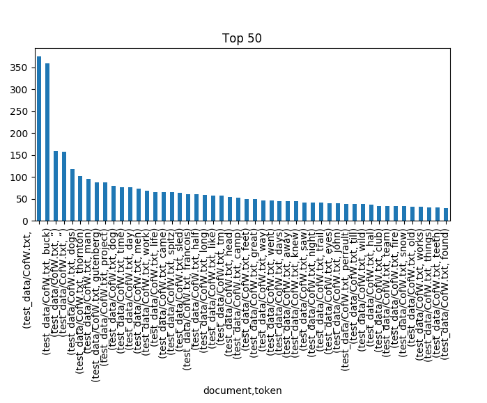

### DocInspect<h1>
Simple script I wrote to look at some features of corpora including token and POS counts. I mostly use it in ipython. I will continue to expand on its features and _prettify_ the graph output.
#### Exclaimer:<h2>
The create_data() function can be a little slow. This should really only be used for single documents until I create a more robust version maybe leveraging matrix operations. Also, this current version does not offer any current token filters, aka stopwords have not been removed. I will look at adding function to fix this.

#### Example:<h2>
- Comes from inspecting Jack London's 'Call of the Wild' obtained through [Gutenberg](https://www.gutenberg.org/ebooks/215)

```python
ipython: run doc_inspect.py
>df, tok, pos = standard_make(['test_data/CofW.txt'])
>tokplot = plot_nlargest(tok['count'])
>plt.show()
```




